# Homepage scene source-asset approval

Status: **sailboat, TJ medallion, phone, notebook, and harmonica approved and live**.

Update 2026-08-22: the sailboat was retired on the owner's request and its
Musings spot went to a Gay Head lighthouse with a wooden Martha's Vineyard
cutout beside it. See
[2026-08-22-lighthouse-and-vineyard-cutout.md](2026-08-22-lighthouse-and-vineyard-cutout.md).
The sailboat sections below are kept as the record of that approval.

This sheet is the gate between a Source Asset and a Scene-ready Prop. The
sailboat is now in `public/models`, the model manifest, the preload list, and
Musings. The owner-supplied TJ crop is now in the authored medallion in About.

## Sailboat candidate

- Source: [Sail Boat by Quaternius](https://poly.pizza/m/BgSZXwmm7k), CC0
  1.0, published 2021-08-17.
- Raw inspection: 1,020 triangles, 56.8 KiB GLB, no texture maps, four
  connected islands, four named materials, 0.4032 × 0.8547 × 0.9890 source
  units. The measured support polygon rests at local y=0; a hull island hangs
  0.0047 units beneath that analytical plane and must be checked on the shelf.
- Intended scene scale: 0.47 units high (`0.47 / 0.8547 = 0.550`), broadside,
  on the Musings lower shelf after owner-requested relocation.
- Proposed material map: warm deep wood (`DarkWood`), warmer hull
  (`LightWood`), off-white sail (`Sail`), restrained navy hardware accent
  (`Steel`). No texture, logo, decal, or invented brand detail.
- Intended behavior: movable keepsake, 0.9 kg/light handling, box collision,
  gravity 3.4, no Portal and no egg; touch remains stationary-only and does not
  carry.
- Pipeline result: 18.5 KiB after production optimization, still 1,020 triangles. This
  exceeds the normal 1,000-triangle target by 20 triangles, but is within the
  plan's inspected-small-exception allowance and below the 64 KiB size target.

### Source and proposed scene-ready angles

Raw source, yaws 0°/90°/180°:

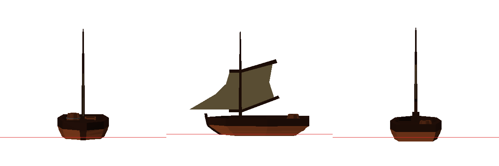

Proposed material treatment, yaws 0°/90°/180°:

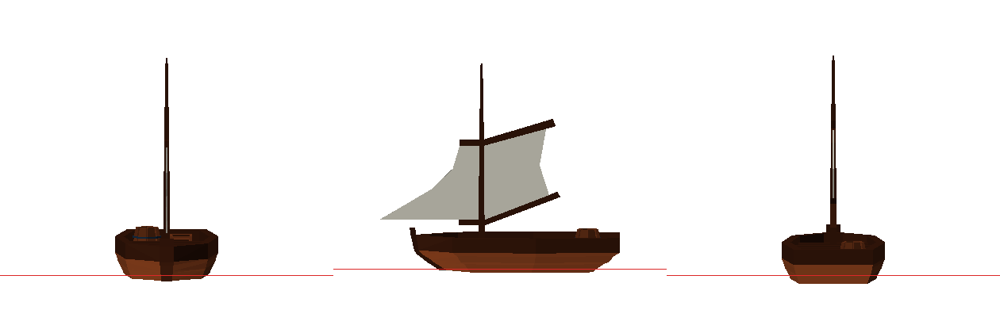

Light/dark context swatches and 390×844 mobile scale study:

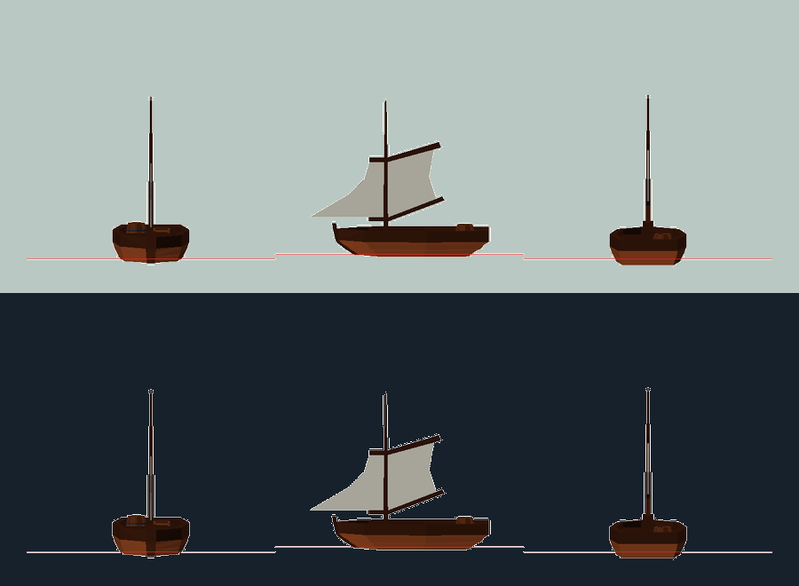

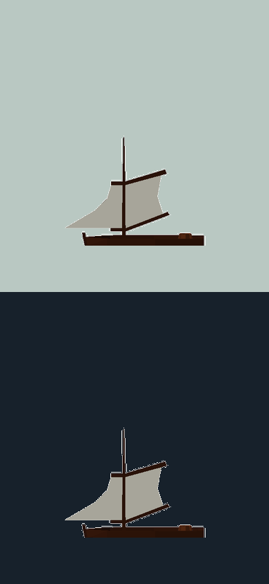

These are the approved geometry/material contact sheets. Runtime materials use
the same named off-white, warm-wood, and navy roles shown here.

Decision: **approved by owner feedback on 2026-08-15 and enabled in Musings**.

- [x] Approve this source and the 20-triangle exception for an in-scene pass.

## TJ medallion

- Source: the owner-supplied exact JPEG crop, located at
  `/Users/chappyasel/Desktop/unnamed.jpg` after the earlier repository-only
  search missed it.
- Construction: authored round enamel/metal medallion and small
  stand, resized to approximately 0.216 units diameter beside the AIC mark;
  the JPEG is applied unchanged—no
  redraw, vectorization, cleanup, generated pixels, or invented logo detail.
- Behavior: movable, 0.45 kg/light handling, box collision,
  gravity 3.4; Portal Label
  `Watch Principles for Living in the Age of Acceleration ↗` opening the
  existing talk URL; no egg.
- Budget: authored geometry remains below 1,000 triangles; the exact crop was
  downsampled to 512×512 and is 62.7 KiB, below the 64 KiB target. One ≤512 px
  owner-supplied texture. Flat-mode fallback is the existing talk link and
  artwork in the DOM.

The medallion uses the supplied seal as its entire face. Its white field, blue
ring, lettering, and central silver mark remain raster-identical apart from
the budget downsample; the authored work is limited to the metal edge and
stand.

Decision: **approved by the owner's request to restore the missing TJ object
on 2026-08-15 and enabled in About**.

- [x] Exact owner crop identified and visually inspected.
- [x] No redraw, generated detail, substitute logo, or brand embellishment.

## Owner-requested phone, notebook, and harmonica

The owner supplied the exact three Poly Pizza URLs in feedback on 2026-08-15
and explicitly requested their placement. That request is the source approval;
the pipeline still applies the geometry, license, support, and visual gates
before the models enter the preload list or scene.

| Prop      | Source / license                                                           |                    Raw |         Scene-ready | Placement / behavior                                              |
| --------- | -------------------------------------------------------------------------- | ---------------------: | ------------------: | ----------------------------------------------------------------- |
| Phone     | [Phone by Alex Safayan](https://poly.pizza/m/1L9oJAw6nY2), CC-BY 3.0       |    728 tris / 78.3 KiB | 704 tris / 27.2 KiB | Projects lower shelf, face-up, 0.19 kg, movable, no Portal/egg    |
| Notebook  | [Notebook by jeremy](https://poly.pizza/m/9Ptsg_xZt6B), CC-BY 3.0          |    568 tris / 23.6 KiB |  321 tris / 6.4 KiB | Projects lower shelf, lying flat, 0.45 kg, movable, no Portal/egg |
| Harmonica | [Harmonica by Poly by Google](https://poly.pizza/m/8Aw334FnDZE), CC-BY 3.0 | 968 tris / 1,367.8 KiB | 870 tris / 29.6 KiB | Talks upper shelf, 0.18 kg, movable, no Portal/egg                |

The phone and notebook are plain-material models. The notebook's three named
materials are mapped into the dawn palette without adding marks or branding.
The harmonica's source texture was the budget outlier; it was resized to 128 px
before optimization, retaining the visible openings and metal silhouette while
bringing the compressed GLB below 64 KiB. All three are bottom-normalized and
stay below the 1,000-triangle live target.

Source and scene-ready three-angle sheets:

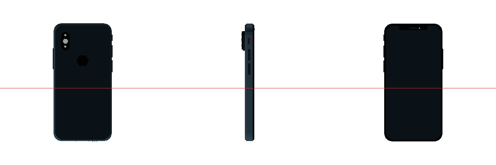

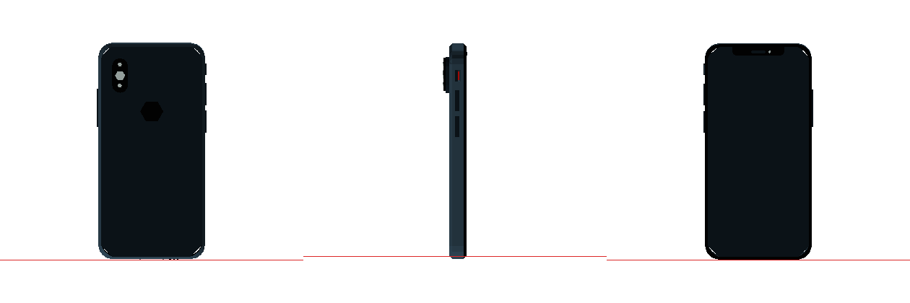

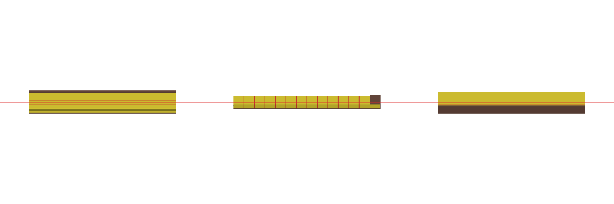

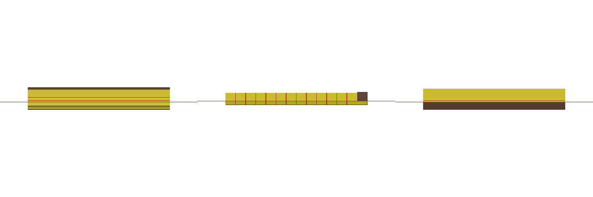

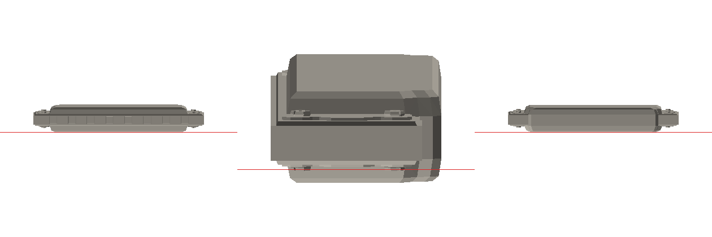

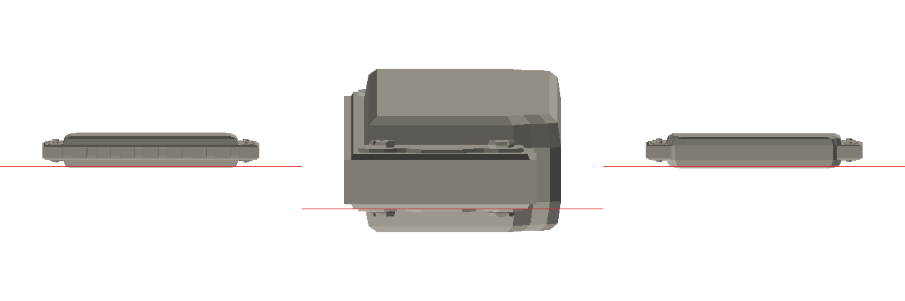

Desktop and mobile in-scene comparisons, covering light and dark modes:

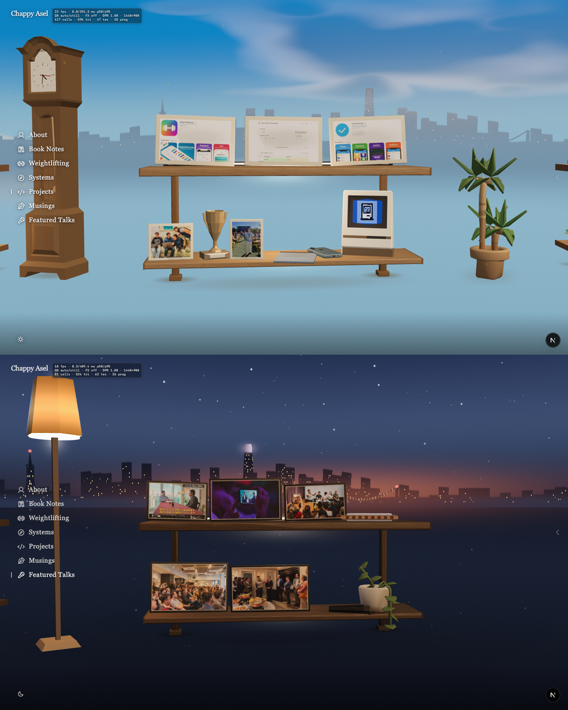

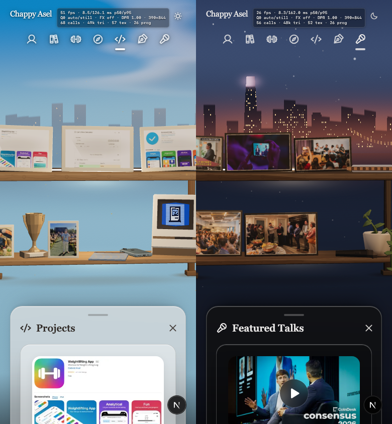

Decision: **approved by explicit owner selection and passed source/pipeline and
in-scene review on 2026-08-15**.

## Authored shaker reference

The shaker is not a sourced model and therefore does not require stock-asset
approval. Its proportions use the official
[BlenderBottle Classic](https://www.blenderbottle.com/products/classic/)
20-ounce dimensions only as reference. The live prop is non-branded authored
geometry: smoky faceted cup, charcoal loop/spout lid, subtle marks, and a
stainless whisk, with no texture map or copied trade dress.
