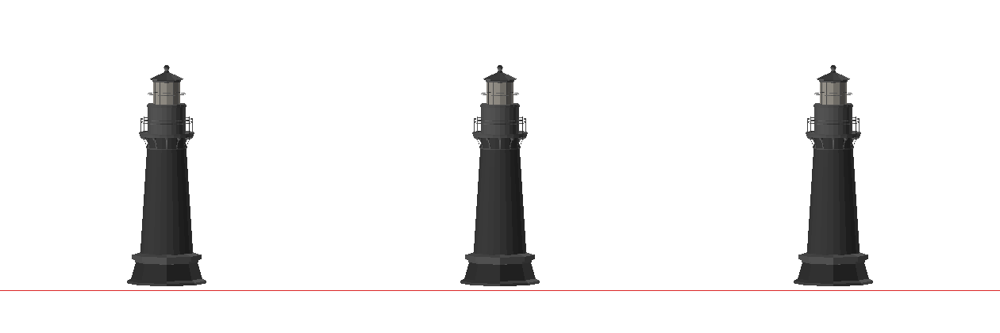
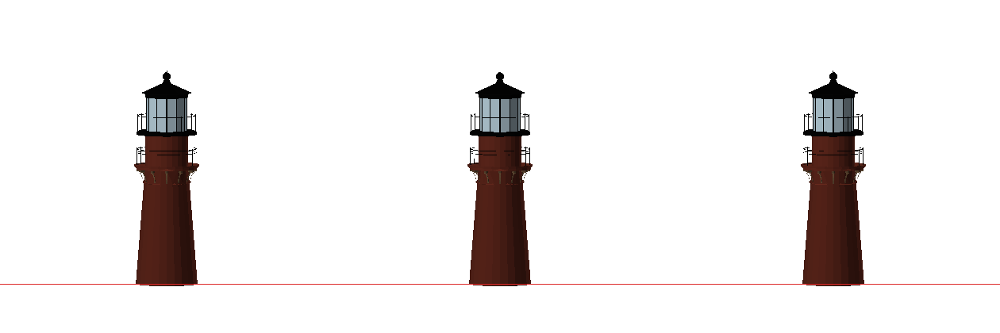
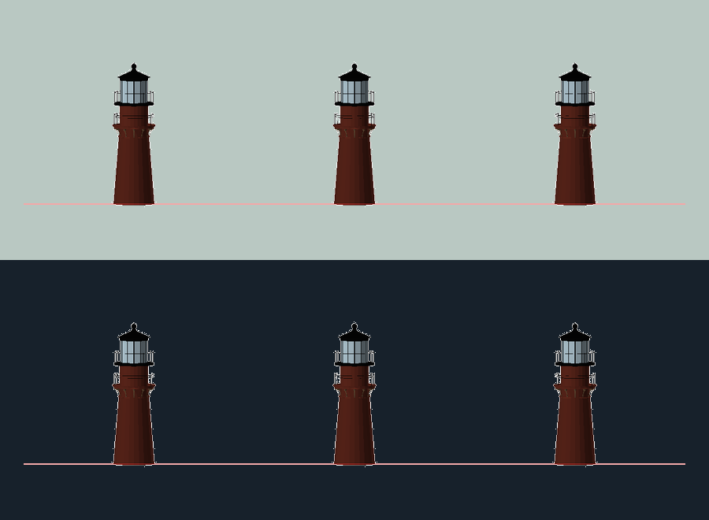
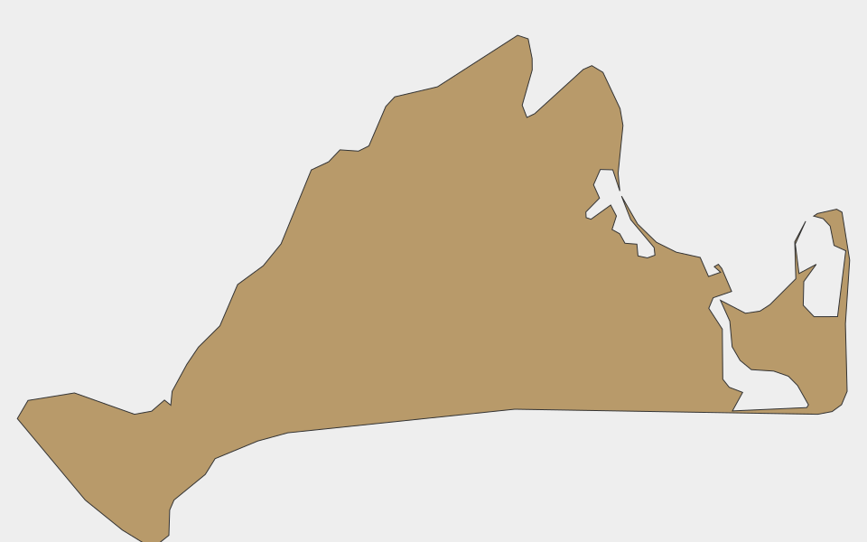

# Homepage scene: Gay Head lighthouse and the Vineyard cutout

Status: **lighthouse and cutout live in Musings; sailboat retired**.

The owner asked on 2026-08-22 to replace the Musings sailboat with the
Poly Pizza lighthouse at <https://poly.pizza/m/3gEvVZoTN7e>, dress it as Gay
Head Light (Aquinnah, Martha's Vineyard), and add the island itself as a
worn wooden piece. This sheet is the gate between those two Source Assets and
the Scene-ready Props that shipped, in the form the 2026-08-15 ledger used.

## Sailboat, retired

Quaternius "Sail Boat" (BgSZXwmm7k, approved 2026-08-15) came out of the
manifest, the preload list, Musings, the Perch catalogue and `public/models`.
The record of its approval stays in
[2026-08-15-home-scene-source-asset-approval.md](2026-08-15-home-scene-source-asset-approval.md).

## Lighthouse

- Source: [Lighthouse by Robert Mirabelle](https://poly.pizza/m/3gEvVZoTN7e),
  CC-BY 3.0, published 2017-11-29 (a Poly-by-Google-era obj2gltf export).
  CC-BY, so Robert Mirabelle joins the credits roster: `LICENSES.json` lists
  him under `attributionRequired`, and the About placard's sr-only credit
  line reads the roster, so no hand edit was needed.
- Raw inspection: 11,762 triangles, 234 KiB, no texture maps, 20 nodes, six
  plain materials whose names do not follow the parts ("white" is the mid
  grey tower, "black-2" is both the railings and the plinth). 71 connected
  islands; the two railings alone are 4,224 triangles.
- Pipeline (`scripts/stacks-models.mjs`, new `dropNodes`, `rematerial` and
  `nodeTransforms` surgery): the interior lamp (`llight`, 998 tris, hidden
  behind the panes), the horizontal pane bar, the dome ribs, and — after the
  owner's first look ("get rid of that bottom brown part") — the octagonal
  plinth and its ring are dropped, so the brick meets the shelf the way the
  real tower meets the grass. Every surviving mesh is regrouped under role
  materials the runtime tints by name: Brick (tower, deck, drum), Stone
  (corbel ring), Iron (railings, lantern frame, dome, ball, spire) and Glass
  (blend, alpha 0.55). Then reproportioned in place ("make the head bigger
  and bottom a little shorter"): the tower squashed to 0.8 of its height
  about its foot, everything above it lowered by the 42.5 source units that
  frees, and the lantern group grown 1.3× about the lantern floor, its floor
  plate ending up r 51 like the photo's overhanging lantern deck. Tower :
  gallery : head goes from 43 : 18 : 25 to 47 : 23 : 29 of the height,
  against the photo's roughly 38 : 21 : 24. Decimated at 0.003: at 0.004
  meshopt starts eating railing posts and the rails read as dashes. Result
  2,852 triangles, 29.5 KiB. Over the 1,000-triangle target and recorded here
  as an inspected exception; it is 1.1% of the 250,000-triangle Safety
  checkpoint budget and sits outside the initial-route budget like every GLB.
- Scene-ready treatment (`UnitBlog.tsx`): Gay Head's weathered brick (the
  first pass was too deep and saturated; the owner asked for "more
  faded/weathered", so the brick is now a sun-bleached salmon and the corbel
  band a greyed brownstone), black iron above the gallery, pale lantern
  glass in light with a faint warm emissive, warm lit glass in dark. Scale
  0.0016 on the 397-unit build is 0.63 units to the spire tip (0.57 to the
  ball), a 32 cm souvenir at the shelf's 2 u/m, under the lower bay's 0.81
  of headroom. No texture, decal, or invented plaque.
- Behavior: movable keepsake, 1.1 kg (the `tip` band), box collision. At its
  shelf scale the collider is a five-box compound (tower, plinth, rails,
  glass); at source scale it would fall back to one box, which is why the
  collider test scales it first.
- Perch: `musings:lighthouse-dome`, the lantern dome front-right, copied
  back from the resolved triangle contact on the rebuilt model
  (`[1.218, -0.3065, -0.062]`). The gallery deck measures flat and rejects
  as `approach-blocked`: the tower, deck and drum weld into one island whose
  box reaches the lantern floor. `UnitBlog.landing.test.ts` lands five
  variations on the dome against the real GLB. (The dead-front dome contact
  landed four of five; the front-right one lands all five.)

### Source and scene-ready angles

Raw source, yaws 0°/90°/180°:

Built prop (baked role colours; the runtime tints refine them), yaws 0°/90°/180°:

Light/dark palette fields:

Decision: **approved by the owner's selection of the source and the Gay Head
reference on 2026-08-22; enabled in Musings**.

- [x] Source page identifies author and licence; CC-BY credit flows through
      the generated roster.
- [x] Triangle exception inspected: railing survival is the reason, and the
      decimation ceiling is measured, not guessed.

## Martha's Vineyard cutout

Authored geometry rather than a sourced model, so no stock-asset approval is
owed; this records what was built from the owner's file.

- Source: the owner-supplied silhouette
  (`/Users/chappyasel/Desktop/map-transparent.svg`, one filled path, 964×592
  viewBox), committed at
  `docs/research/assets/2026-08-22-vineyard-cutout/marthas-vineyard.svg`.
- Construction: `scripts/stacks-vineyard-outline.mjs` flattens the path and
  keeps the outer coastline only (twelve pond holes and five specks dropped;
  a pond hole would be a scratch-width speck at shelf scale and real wooden
  cutouts of the island are solid), thins it with Ramer–Douglas–Peucker to
  121 points, and writes `vineyardOutline.ts`. `VineyardCutout.tsx` extrudes
  that at 0.42 wide (a 21 cm piece), 8 mm thick with a small bevel, standing
  in a slotted wooden foot with a slight backward lean, in the shelf's own
  grain texture at a paler, sun-bleached tone so it reads against the plank.
  It stands rather than lies because the camera sits ~11° above the lower
  shelf and a flat piece would foreshorten to nothing.
- Seating ("make sure the Martha's Vineyard isn't floating"): with north
  dead up, the south shore climbs 0.073 units from the Squibnocket lobe to
  Chappaquiddick, so a narrow slot under the lowest point left the east half
  in the air. Measured over the outline's lower envelope: rolling the island
  8° clockwise (east end down) and swallowing 0.03 of the coast in a
  full-width, 0.05-tall foot brings every point of the shore within ~0.02 of
  the foot's top; the concave middle arches about 1 cm real above it, which
  is what a cutout resting on its two low points does.
- Behavior: movable, 0.16 kg (the `tip` band), box collision, turns square to
  the camera while carried (the sticker's `HeldFacing`). No Portal, no egg.

## Trust essay booklet (same day, second request)

The owner asked for <https://www.aicollective.com/trust> in place of the three
flat books on the lower shelf, "a creative way to show it", and #1 on the
Musings list.

- What it is: his own essay "Trust in the Age of Acceleration" (The AI
  Collective, 2025-04-03, with a printed PDF). Not a sourced model; authored
  geometry plus one owner-owned image.
- Construction (`units/TrustEssay.tsx`): a full US Letter booklet (0.432 ×
  0.559 × 0.008), matching the loose GPT-3 pages beside it, standing on a
  small oak reading stand (base, front lip, two
  leaning slats), reclined 0.35 rad so the ~11° camera sees the cover. The
  cover is page one of the real PDF (the beam artwork and title block)
  rasterised at 945 px and shipped as a 512 px webp (70 KB,
  `public/images/stacks/musings/trust-2025-cover.webp`), the same treatment
  as the GPT-3 pages in PaperStack. The creative detail is the binding: a
  stab-sewn spine in a warm cord, because the essay's own line is "trust is
  the invisible thread that holds the world together". Thread radius is
  deliberately fat (3 mm) for the same legibility reason the paper sheets are
  2.2 mm thick.
- Behavior: movable, 0.2 kg (`tip`), box collision, turns square to the
  camera while carried, Portal `Read Trust in the Age of Acceleration` to the
  essay.
- Perch: `musings:trust-cover` on the reclined cover, derived from the same
  constants as the geometry (`musingsShelfGeometry.ts`). Validated once
  against a box mirror of the prop: five landing variations rest on the cover
  mesh at unit-local `[0.1700, -0.4727, -0.1184]`. Read it back from the HUD
  next time the scene is open.
- Musings list: the essay is item #1 in `public/data/blog-posts.json` (it is
  also the newest by date), and `scripts/generate/blog-posts.ts` now carries
  it as a pinned entry so a Medium refresh cannot drop it. Since the first six
  items become the upright spines on the Musings top shelf, the essay is
  spine #1 there too. Thumbnail is the AIC page's own OG image, remote like
  the Medium thumbnails.
- Retired with the flat stack: `MUSINGS_LOWER_BOOK` and the
  `musings:book-pile-top` Perch.

## Town-mileage signpost

The owner supplied a product photo of the framed Martha's Vineyard
town-mileage sign print (`~/Desktop/il_fullxfull.4714019740_27wx.avif`, not
committed) and asked to "extract the sign and include it as well".

- Extraction (`scripts/stacks-vineyard-sign.mjs`): crop inside the frame's
  bevel, flood-fill the mat from the border to alpha 0, trim, 640 px webp
  (35 KB, `public/images/stacks/musings/vineyard-sign.webp`). The catch,
  measured: the cream panel is not enclosed at its sides and is within a few
  levels of the mat in brightness, so the fill keys on temperature (mat and
  drop shadow neutral-to-bluish, panel warm) rather than brightness. No
  redraw, no retouch; the feather is one pixel.
- Prop (`units/VineyardSign.tsx`): the die-cut face on an invisible backing
  box (the sticker's technique) over a white square post with a round oak
  foot, 0.22 wide (an 11 cm souvenir), between the Trust booklet and the
  island at x 0.48. A second plane faces backwards with the image mirrored
  in UV so the text reads the right way round from behind when carried.
  Movable, 0.12 kg, turns to the camera while carried. No Portal.

## Sand tray and the turning light

"Is it possible to add something resembling sand" took three passes on
2026-08-22: a round tray first; then, because he meant sand strewn around
the corner, loose sand (instanced grains broke physics — the collider
extractor reads an InstancedMesh's base geometry bounds, a two-unit
tetrahedron — and texture-only decals read as paint); then "bring back the
circular sandbox". `units/SandTray.tsx`: a weathered-oak ring (r 0.125,
12 mm thick, 30 mm tall) with a polar grid of sand inside it, flat at the
rim, piled in a rounded slope against the tower's foot and rippled a little,
under a one-pixel speckle grain drawn onto a canvas and used as colour and
bump. The lighthouse's authored base rises to the sand's crown (0.026). Rim
and sand are flagged `physicsIgnore` with no pointer raycast: scenery, not a
wall. The lighthouse lifts out on its own; dropped back in simulated mode it
lands on the plank a centimetre lower, which only sinks it deeper. Granular
physics stays out of scope: cannon-es boxes cannot flow. The tray is the
lighthouse's footprint for spacing: the parallel session's
`MUSINGS_LOWER_LAYOUT` packs the lower shelf around a 0.125 tray, with
`lighthouseX` 1.184 (rim 1 cm short of the plank's end, clear of the
cutout's foot corner).

He also asked for "some spinning light inside or is that a bad idea". It is
a fine idea inside two limits, both kept in `units/LighthouseBeacon.tsx`: no
real light source (the world budgets one real light per unit and every extra
pointLight recompiles every program), and no motion under reduced motion. So
an emissive lens, two short additive beam wedges turning inside the glass at
one revolution per 8 s, and a flash sprite whose opacity peaks when a beam
points at the camera — a lighthouse from a distance is a flash every time
the beam comes round, not a visible cone. Gay Head's characteristic is
alternating white and red, so one beam is warm white and the other red, and
the flash takes the colour of whichever faces you. The motion rides
`useUnitFrame`, so an off-screen unit does not spin. Dark is the show; light
keeps a faint version so the lantern reads as lit.

## Headphones Portal

The Musings headphones now open <https://soundcloud.com/chappyasel>
(`Listen to Chappy on SoundCloud`). No geometry change.

## Tea cue and top-shelf spacing

Isa Lousberg's CC0 kettle (`vhYEWaQZvT`) now sits behind the cup. Its 587
triangles keep the source's white enamel and gray-silver details instead of
using the warm shared palette. The private texture is capped at 128×128, and
the finished GLB is 23 KB. The final layout is bound-driven rather than a list
of independent centres: the generated book row is right-aligned by its
occupied interval; the two-book flat stack determines the headphones'
x-position and 0.104-unit support height; the open book sits 0.025 before the
row; the book's left edge sets the tea-service boundary; and the kettle is
1.55 times the cup's measured width. The book moved forward to z −0.10, while
the cup moved back to z 0.27 and the kettle to z −0.04. The cup also shifted
left within the tea service so the reordered real model bounds do not
intersect the book, kettle, or articulated lamp. The tea butterfly still lands
on the cup handle; its anchor follows the cup's authored pose and remains
outside the bowl.

The sand tray is no longer static scenery. It, the sand surface, the wooden
rim, and the lighthouse now share one 1.4 kg Grabbable carrier and one physics
body. The rim's outer wall has a separate cylindrical UV strip so wood grain
wraps around the visible side instead of collapsing into the annulus UVs.

## Composition

The lower shelf's centres live in `MUSINGS_LOWER_LAYOUT`
(`musingsShelfGeometry.ts`), packed by measured front-view footprint by a
parallel session on 2026-08-22: plant −1.15, mug −0.883, paper −0.451, Trust
booklet 0.087, signpost 0.435, island cutout 0.797 (z −0.20), lighthouse 1.174
in its sand tray (tray 1.049–1.299, z −0.205..0.045), and the Vineyard Vines
sticker flat in front at x 0.90. The camera is near frontal and ~11° up, so
the lower shelf is effectively one row and x-overlap is occlusion. The tray
rim stops 2 cm short of the plank's end and clear of the cutout's foot
corner; nothing reaches the front lip.

## Still open

- Owner look at the live scene in both themes: weathered brick hue, lantern
  glow strength, cutout tone, roll and seating, lighthouse proportions and
  height, sign size, whether the sand reads as sand, whether the beacon's flash is the right strength.
- `yarn generate:home-og:local` after the scene settles; every visual edit
  invalidates the OG fingerprint.
